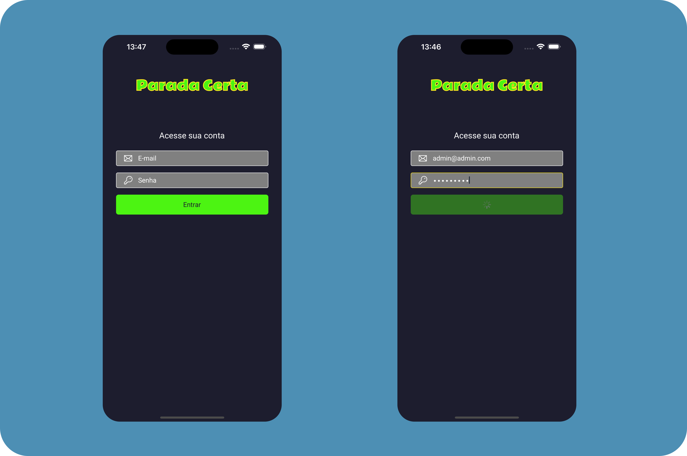

  <p align="center">
   
  </p>

  
<p align="center">
   
  </p>

# :clipboard: Sobre o projeto

Este pequeno aplicativo de um estacionamento, onde você podera adicionar o tipo
do veículo ex: Carro ou Moto e a placa do mesmo. onde ao finalizar será informado
o tempo estacionado e o valor a ser pago. 

Abaixo podemos ver o resultado final do projeto. Espero que gostem!

<br>
    <p align="center">
         
  </p>

# 🔗 Acesse o meu site com o link abaixo.

- [William Pereira | Portfólio](https://www.willtechcod.com/)

- [Node.js](https://nodejs.org/en/)
- [Styled-Components](https://styled-components.com/)
- [HTML](https://developer.mozilla.org/pt-BR/docs/Web/HTML)
- [CSS](https://developer.mozilla.org/pt-BR/docs/Web/CSS)

## 🌐 Para iniciarlizar o projeto utilize o comando abaixo:

```bash

#Clonando o repositório do Github:
$ git clone https://github.com/willtechcod/garagem.git

#Acessar pasta Web:
$ cd Web garagem

#Instalar node_modules:
$ npm install

#Inicializar pasta Web:
$ npm run start

```
